# Deep Time-to-Failure
A tutorial on how to implement an algorithm for predictive maintenance using survival analysis theory and gated Recurrent Neural Networks in Keras.

The tutorial is divided into:
1. Fitting survival distributions and regression survival models using lifelines.
2. Predicting the distribution of future time-to-failure using raw time-series of covariates as input of a Recurrent Neural Network in keras.

The second part is an extension of the [wtte-rnn](https://github.com/ragulpr/wtte-rnn) framework developed by @ragulpr.
The original work focused on time-to-event models for churn predictions while we will focus on the time-to-failure variant.

In a time-to-failure model the single sequence will always end with the failure event while in a time-to-event model each sequence will contain multiple target events and the goal is to estimating when the next event will happen.
This small simplification allows us to train a RNN of arbitrary lengths to predict only a fixed event in time.

The tutorial is a also a re-adaptation of the work done by @daynebatten on predicting run to failure time of jet engines.

The approach can be used to predict failures of any component in many other application domains or, in general, to predict any time to an event that determines the end of the sequence of observations. Thus, any model predicting a single target time event.

# Installation

Required dependencies are: keras, tensorflow, matplotlib, seaborn, scikit-learn, pandas, numpy, wtte, lifelines.
The notebook examples were developed in Python 3.5.

# Theory

## Survival analysis

The techniques described in this tutorial are based on the survival analysis theory and applications. Survival analysis is the study of expected duration of time until one or more events happen, in our case failure in mechanical systems.

Survival analysis differs from traditional regression problems because the data can be partially observed, or censored. That is, we observe a phenomenon up to a point in time where we stop collecting data either because the failure event happens and is registered (uncensored) or because it was not possible to collect data furtherly (censored) due to technical issues or because of the failure is not happened yet at current time. We are not considering the case where data is left-censored. We assume we can always observe the beginning of the signal or events sequence.

The survival model is then characterized by either its **survival function S(t)** defined as the probability that a subject survives longer than time t; or by its **cumulative hazard function H(t)** which is the accumulation of hazard over time and defined by the integral between 0 and t of the probability of failing instantly at time x given that it survived up to x.

From the survival function we can derive the distribution of **time-to-failure** or future lifetime, which is the time remaining until death given survival up to current time.

### Non-parametric distributions

In literature we often find two main non-parametric estimators for fitting survival distributions. They are the **Kaplan-Maier** and **Nelson-Aaler** estimators.

### Weibull distribution

The Weibull distribution is used instead for modeling a parametric distribution that well represent the future life time in many real-word use cases.
The Weibull distribution is defined as by parameters alpha and beta as such:

 for his continous form, or

 for the discrete form.

The parameter alpha is an indicator of where the expected value and mode of the distribution is positioned in time while the beta parameter is an indicator of the variance of our prediction (the larger the less confident).

## Survival regression

### Statistical regression techniques
Fitting a distribution can be worth in case that we want to compare different populations, e.g. in clinic tests, and decide whether there is a statistical signficance between the different survival curves. In order to predict the time-to-failure we want to use different features as regressors and predict as output the survival function, or related functions, of each individual.

For static attributes or hand-crafted features (e.g. lags, accumulated statistics, aggregated statistics) we can use the **[Cox's Proportional Hazard model](https://en.wikipedia.org/wiki/Survival_analysis#Cox_proportional_hazards_(PH)_regression_analysis)** or **[Aalen's Additive model](http://lifelines.readthedocs.io/en/latest/Survival%20Regression.html#aalen-s-additive-model)**.

Both Cox's and Aalen's models are based on a non-parametric baseline of the survival function which is multiplied by another function which is a combination of the input features. Both of them do a good job on describing the variables that impact the survival of a given individual. Nevertheless, they are limited in the type of input data that can handle and suffer from low generalization due to the high degree of freedom of the non-parametric nature of the model.

### Timeseries and Recurrent Neural Networks

DeepTTF leverages raw time-series of the covariates in addition to static attributes as input features in order to predict as output the parameters alpha and beta that characterize the Weibull distribution of the future time-to-failure (T) at any sequent point.

Source: https://github.com/ragulpr/wtte-rnn/raw/master/readme_figs/fig_rnn_weibull.png

Using the word 'time-series' is not 100% appropriate because RNNs are sequential models. Thus, they work in discrete time steps and not in a continuous timespace. This implies that all of the time-series should be binned in time intervals representing the resolution of time.
All of the signals should then be syncronized in time and no gaps are allowed. In order to filter the noise you can also choose to increase the time interval of each step and extract the mean or median instead of the raw values.
In our examples, variable t represents time steps and not the actual time in the proper definition of a time-series.

You can read more about the theory and intuitions behind the Weibul time-to-event RNN following the documentation of [wtte-rnn](https://github.com/ragulpr/wtte-rnn) or in his presentation at the [ML Jeju Camp 2017](https://docs.google.com/presentation/d/1H_TK9eQCMGTcslc4AnMCNTUskWIYcJAxsV18ac-fIqM/edit#slide=id.g1fa2ecfbc0_0_38).

# Examples

## Survival analysis and regression using lifelines

The notebook with examples of how to leverage lifelines for fitting a survival function or a survival regression will be published soon.

## Time-to-failure using Weibull and Recurrent Neural Networks in keras
In this example we took sequences of a bunch of parameters for 100 jet engines in order to predict when each engine failed.

### Data preparation

Among all of the available parameters and settings we selected 17 time-series of relevant features.
The data preparation consisted in removing constant features and normalizing between -1 and 1 the min and max of each variable.

Since each engine has a variable sequence length, we fixed a look-back period of 100 steps and used the Masking layer in Keras for handling the different sequence lengths. Ideally we should select a look-back period equal to the number of steps required for achieving a stationary process. That is, a process whose outcome depends only from the last N observations and is independent from everything that happened before. This assumption is generally held in case of component failures that works as new for a long period and suddenly start decaying. In the latter scenario the decaying period corresponds to the lock-back period. If we also want to capture aging effects that are relevant since day 1, we should then use as look-back period the maximum sequence length possible in the dataset and assuming that no any component can last longer than that.
Pay attention that keras does not support a mask_value=np.nan hence we had to choose a magic number of -99 which is a safe choice since our input space is confined between -1 and 1.

The samples in the traning data are each subsequence between 0 and t with t ranging from 1 up to the latest observation of each engine.
The last observation corresponds to the step preceding the failure event.
In other words, we want to predict the reamaining time-to-failure (T) of training engines at each possible time-step until the last one where the time-to-failure is 1. The target variable is then a countdown function of the time.

The variable E represents wheter the corresponding T was observed (1) or censored (0).

Please pay attention that each subsequence is an individual sample. Thus, keras will restart the state of recurrent cells at the end of each subsequence even if sequential subsequences may be present in the same batch. This is fundamental in order to build the cumulated latent representations of our engine state over time.

### Training with censored data

In the notebook example all of the data is observable (E=1) and we are not considering censored sequences.
If you would like to extend it to include censored observations, you should pick a point in time t_current (e.g. 200) and filter out all of the observations in the training set that are later than the representative current time. 
The new target variables (T', E') for training will be:

 - T' = min(T, t_current)
 - E' = if T <= t_current 1 else 0

You could leave the test target as is so that you can compare how your test accuracy changes when training with censored data as function of the t_current, aka. what is the effect (Bias error Vs. Variance error) when the fraction of censored observations increases.

### Architecture

We used a single recurrent layer made of 20 GRU followed by a dense output layer of dimensionality 2 with a custom activation layer (alpha and beta output values).

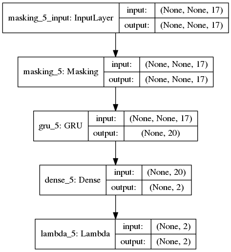

The activation layer is a custom function that the author of wttt-rnn set to an exponential function for alpha and a sigmoid function between 0 and beta_max for parameter beta.
The rationale is that alpha should always be greater or equal than 1 and beta should be between 0+ (high confidence) and a maximum value beta_max that act as both regularizer and stabilizer.

The tuning parameters are:
 - GRU with activation='tanh', recurrent_dropout=0.25, dropout=0.3
 - Adam optimizer with lr=.01, clipnorm=1

### Debugging nan weights

In general nan weights happen when the data is not properly scaled or normalized or if beta values are too large. In the latter case I recommend to downscale the values of time steps in case you are not using multiples of 1. Try to use shorter sequences such that the maximum beta parameters does not exceed 500.
If using TensorFlow as back-end, set the epsilon value to 1e-10.
In case you still get nan weights, could be beneficial to also add clipvalue=.5 to the optimizer paramters to avoid large gradients.

### Training

After have trained for 100 epochs with a batch size of 128 we can plot the loss functions on both train and test set:

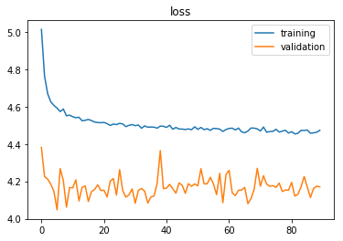

Surprisingly the loss function on the test data is lower than the training one. Axctually, this is an expected results because the training set contains all of the subsequences of any length while the test set contains only middle length sequences. The accuracy on very short sentences is clearly much lower, thus the training data is penalized.

We can also observe that the best stop point we would have achieved with early stopping is around 30 epochs.

By looking into the bias terms and weights of the output layer we can see the evolutions of the alpha and beta parameters:

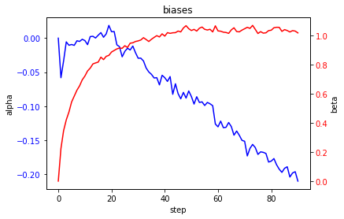

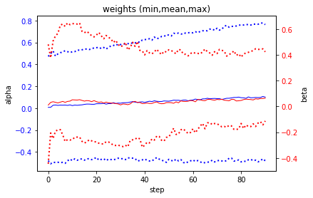

The bias of alpha has a decreasing trend symptom of overfitting while the beta term is quite stable.
Remember that the smaller the weights the less your predictions are actually depending from the input covariates and the more the bias term act as default predictor.
For example, if you remove the dropout regularizer you would observe constant predictions for every sequence regardless of the input values.

### Evaluation

When we test our model we pick another set of 100 engines but this time we want to test the accuracy once for each engine. The test dataset provides already truncated versions of the test time-series with the remaining time-to-failure as external information.

If we look at the distribution of T in the test set and the mean of Weibull parameters we can immediately check if our model does make sense:

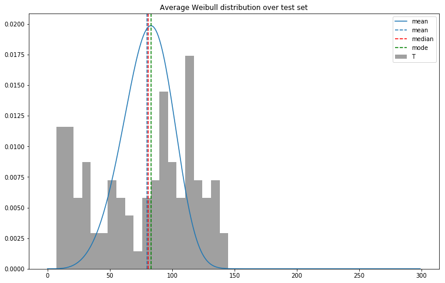
 As expected we can see the mean Weibull distribution overlaps the true distribution.

 If we try to plot all of the Weibull distributions of each of the 100 engines in the test set and marking with a dot the corresponding true value we can see that most of the true values are close to the mode of the distribution (each color represents a different engine):

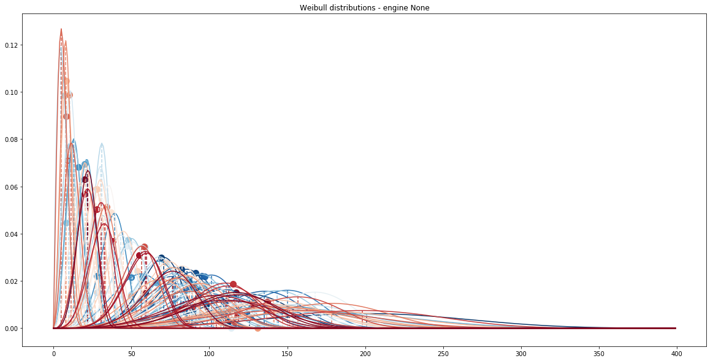

It is interesting to observe the patterns and correlations of alpha and beta by looking at the 2-D density plot of the two parameters:

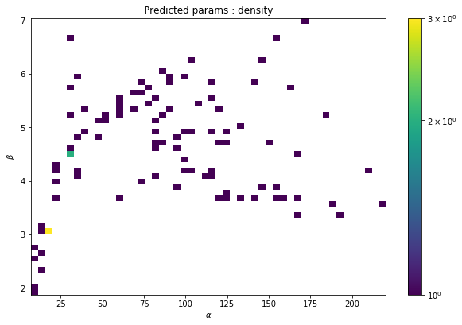

When alpha is really small (below 25) the model is very confident (low betas). As alpha increases (we are far from the failure event), also beta does (our level of confidence is low).

If we woul like to treat this problem as a regression we could use the mode, or alternatively the expected value (mean), of the distribution and compare the error in time.
We can make a regression scatter plot showing the predicted value Vs. the true target:

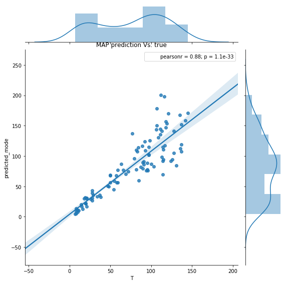
or even more evident using a kernel-density estimation:

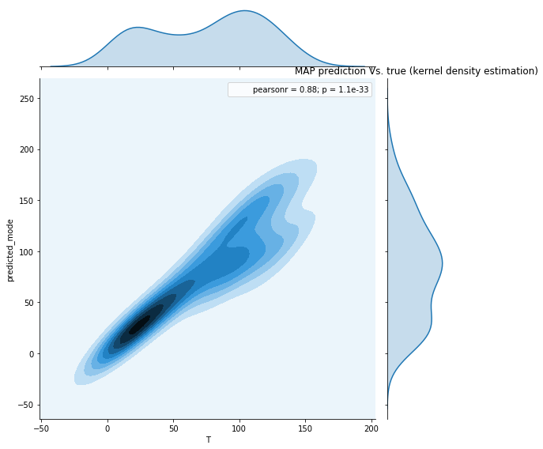

The distribution of residual error will look like:
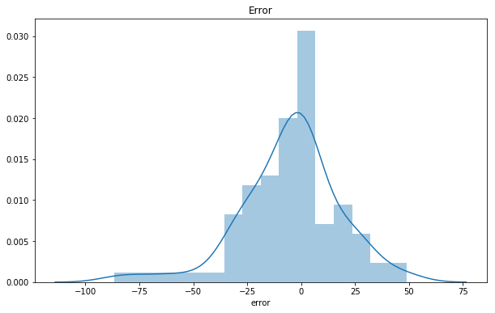

It looks like the result of a GLM (Generalized Linear Model) regression where the residuals belong to a family of non Normal distributions.
The nice result is that the residual error has almost zero mean, aka. unbiased predictions.

Nevertheless, treating the Weibull distribution as a single prediction means losing all of its probabilistic charme. Thus, it is more advisable to reason about your time-to-failure in probabilistic terms or at least to provide some confidence intervals.

If, instead, we pick the engine number 3 from the test set and predict all of its sub-sequences (from 1 to the latest observation), we can see the evolution of the predicted time-to-failure distributions at each time step (blu is the beginning and red is the end of the sequence):

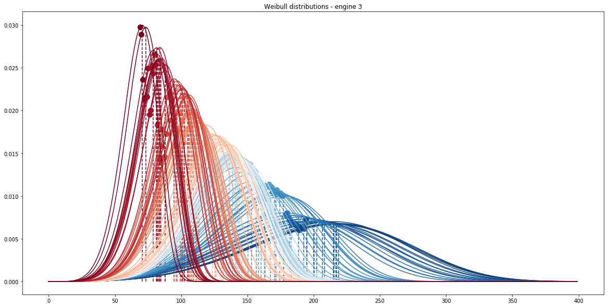

As we approach the real failure the expected time-to-failure gets smaller but also the variance of our prediction become tinier. This is a another evidence that the model learns the correct failure dynamics.

If we plot the predictions at each time step of engine 3 in terms of mode and [10%, 90%] confidence interval we observe the following:

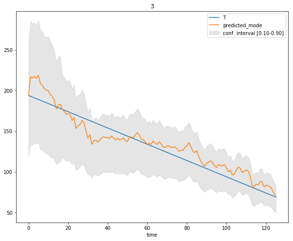

This is a very powerful resource to take into account into predictive modeling: you can decide what risk you want to take on predicting early failures Vs. too-late detections.

# References

Lifelines documentation: http://lifelines.readthedocs.io/en/latest/index.html

Data source original: https://c3.nasa.gov/dashlink/resources/139/

Data source tutorial: https://github.com/daynebatten/keras-wtte-rnn/blob/master/data_readme.txt

[wtte-rnn](https://github.com/ragulpr/wtte-rnn)

[keras-wtte-rnn](https://github.com/daynebatten/keras-wtte-rnn)

# Related work

DeepSurv: https://www.researchgate.net/publication/303812000_Deep_Survival_A_Deep_Cox_Proportional_Hazards_Network
